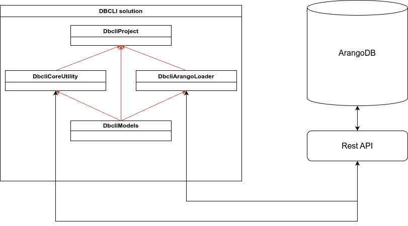
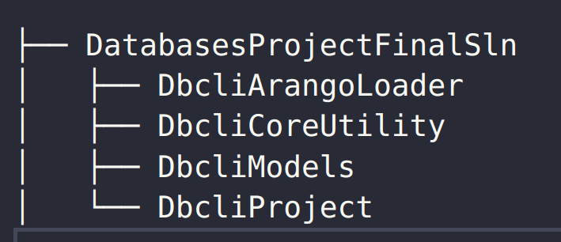
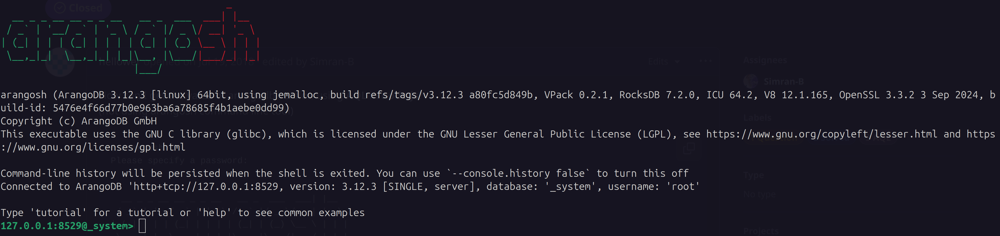

# Dokumentacja Bazydanych

# DBCLI Projekt

Bartłomiej Matuszewski

Jakub Fudro

## 1. Wybór technologii

Podczas pracy nad projektem używaliśmy technologii:

- **komenda linuxa tar do rozpakowania plików .gz**
- **git oraz github do kontroli wersji**
- **Arango DB - Community Edition**
- python 3.10 - wstępna analiza danych (pliki .csv)
- rust 1.83 - próba implementacji programu, pomysł porzucony przez słabą znajomość biblioteki do obsługi Aranago DB (arangors), oraz słabą dokumentację.
- **C#/.NET 8.0 - faktyczna i działająca implementacja programu**

Finalna wersja programu nie ma dodatkowych zależności poza C#/.NET'em oraz Arango DB - Community Edition.

## 2.Architektura



## 3. Wymagania i zależności (moduły oprogramowania, bazy danych itp.)

### 3.1 Wymagania systemowe

Projekt w całości powstał na systemie operacyjnym Linux Ubuntu 20.04.1 (LTS).

### 3.2 Technologia bazodanowa

Jako bazę danych wybraliśmy Arango DB - Community Edition. Arango obsługuje natywnie grafy oraz ma wbudowane funkcje grafowe typu shortest path.

### 3.3 Technologia programistyczna

Jako język programowania wybraliśmy C#/.NET 8.0. Popularna technolgia korporacyjna do tworzenia aplikacji.
Technologia jest multiplatformowa i ma licencję MIT.
W naszym projekcie wykorzystaliśmy .NET w wersji 8.0 (najnowszy standard w momencie ropoczynania pracy).
Do komunikacji z bazą danych użyliśmy biblioteki ArangoDBNetStandard.
Jest to oficjalna biblioteka do komunikacji z bazą udostępniona przez producenta.
Biblioteka działa pod licencją Apache 2.0.

### 3.4 Moduły programu

Drzewko programu wygląda następująco:



### 3.4.1 DbcliArangoLoader

Bilioteka do naprawienia pliku popularity_iw.csv, który jest źródłem danych popularności dla node'ów grafu.
Drugą funkcją biblioteki jest kolekcja funkcji do ładowania danych do bazy ArangoDB.

### 3.4.2 DbcliCoreUtilities

Biblioteka zawierająca funkcje wykonujace odpowiednie query na grafie w bazie ArangoDB.

### 3.4.3 DbcliModels

Biblioteka zawierająca modele danych, które są używane w programie. Głównie są to klasy reprezentujące wartości zwracane przez query podczas zapytań, oraz klasa do seserializacji config'a.

### 3.4.4 DbcliProject

Klasa sklejająca cały solution i udostępniająca interfejs cli do uruchamiania odpowiednich tasków.

## 4. Instrukcje instalacji i konfguracji

W każdej pod-sekcji wklejamy linki do stron z instrukcjami instalacji i konfiguracji ponieważ może się to zmieniać w czasie.

### 4.1 Instalacja Araango DB

Link do instrukcji instalacji Arango DB na Ubuntu: [Arango DB - Community Edition](https://arangodb.com/download-major/ubuntu/)

Dodanie kluczy do repozytorium:

```bash
curl -OL <https://download.arangodb.com/arangodb312/DEBIAN/Release.key>
sudo apt-key add - < Release.key

```

Instalacja apt-get'em:

```bash
echo 'deb <https://download.arangodb.com/arangodb312/DEBIAN/> /' | sudo tee /etc/apt/sources.list.d/arangodb.list
sudo apt-get install apt-transport-https
sudo apt-get update
sudo apt-get install arangodb3=3.12.3-1

```

### 4.2 Instalacja .NET

Link do instrukcji instalacji .NET na Ubuntu: [.NET](http://learn.microsoft.com/en-us/dotnet/core/install/linux-ubuntu-install?tabs=dotnet8&pivots=os-linux-ubuntu-2404)

```bash
sudo apt-get update && \\
  sudo apt-get install -y dotnet-sdk-8.0
```

## 5. Instrukcja obsługi (jak uruchomić program)

W celu zbudowania dociera w głównym folderze projektu należy użyć komendy docker compose up -d. Po zakończeniu budowy projektu możliwe będzie użycie komendy docker exec -it adv-db-systems.app /bin/bash, polecenie to uruchomi shel wewnątrz dociera. Z poziomu dockerowego shela możliwe będzie używanie komend ustalonych w projekcie aplikacji.

## 6. Proces projektowania i wdrażania krok po kroku

Dzięki szerokiemu wachlarzowi funkcji zaimplementowanych w Arango db proces projektowania systemu ograniczył się do zapoznania z możliwościami systemu bazodanowego.

Pierwszym krokiem w procesie wdrażania rozwiązania były testy z użyciem wbudowanego interfaceu Arangodb, celem testów było sprawdzenie które z funkcjonalności możemy obsłużyć używając jedynie wbudowanych funkcji systemu bazodanowego. Arangodb jest w stanie obsłużyć wszystkie wymagane funkcjonalności przy pomocy wbudowanych funkcji.

Kolejnym korkiem było przygotowanie funkcjonalności łączenia się z bazą danych przy pomocy kodu C#, użyta biblioteka była łatwa w obsłudze i pozwalała na przesyłanie zapytań formie string.

Następnie przygotowaliśmy 18 metod (każda z nich odpowiada zadaniu jakie realizować ma aplikacja). Każda z tych metod ma jeden cel, część z nich wymagała parametryzacja.

Kolejnym krokiem było przygotowanie parsera który na podstawie komendy przyjętej przez użytkownika uruchomi odpowiednią metodę aplikacji i jeśli to koniecznie przekaże do niej parametry.

Ostatnim krokiem było przygotowanie środowiska docker które pozwala na szybki deployment aplikacji niezależnie od środowiska w którym jest ona uruchamiana.

## 7. Role wszystkich osób w projekcie i opis tego, kto co zrobił

Bartłomiej Matuszewski: testy w środowisku ArangoDB, przygotowanie zapytań bazodanowych, implementacja kodu C#

Jakub Fudro: testy w środowisku ArangoDB, przygotowanie zapytań bazodanowych

## 8. Wyniki

Niestety nasz deployment w środowisku docker nie pozwolił na przeprowadzenie testów, w trakcie populacji bazy danych aplikacja zwraca wiele błędów. Liczba edge nie zgadza się z liczbą jaka powinna znajdować się w bazie danych. Próba przeprowadzenia kolejnych testów (zadania 10 oraz 16-18) byłaby niemiarodajna lub nie możliwa (ścieżki jakie miał zwrócić program mogą nie istnieć)

## 9. Instrukcja krok po kroku jak odtworzyć wyniki

Skrypt benchmarkowy powinien zwrócić 6 plików (1 plik na każdą z mierzonych funkcji) które następnie powinny zostać podsumowane  przy pomocy Jupyter notebooka. Notatki podsumowuje i oblicza średnią dla 4 ustalonych funkcji i generuje wykresy obrazujące działanie aplikacji w czasie.

## 10. Samoocena: należy omówić efektywność

Funkcje od 1 do 18 wykonują się bardzo szybko, sam system bazodanowy jest dobrze zoptymalizowany a przygotowany przez nasz zespół wraper C# nie wpływa znacząco na efektywność wykonywania zapytań. Problemem jest populacja bazy danych, zapisywanie bazy danymi jest powolne, interface przeglądarkowy jak i ten CLI wykonują operacje zapisu danych znacznie szybciej.

## 11. Strategie przyszłęgo łagodzenia zidentyfikowanych niedociągnięć

Największym problemem projektu jest populacja bazy danych, podejrzewamy, że skorzystanie z narzędzi CLI przygotowanych przez deweloperów systemu ArangoDB może usprawnić proces ładowania danych

# Dokumentacja Techniczna (szczegółowa)

Podczas developowania oraz testowania aplikacji korzystaliśmy z systemu operacyjnego Ubuntu 20.04.1 (LTS), który obydwoje mamy zainstalowanego na osobistych komputerach.
Arango DB - Community Edition w wersji 3.12.3 na systemy linux (konkretnie na Ubuntu 24.04) było zainstalowane lokalnie na systemie bez kontenerów.



Środowisko programistyczne/technologia programistyczna której używaliśmy to .NET 8.0 oraz C# w wersji 12.

## Setup środowiska developerskiego

Aby zainstalować paczki do .NET'a oraz Arango DB używaliśmy package managera apt-get.
Poniżej przedstwiamy szczegółowe instrukcje jak zinstalwoać te paczki na systemie linux/ubuntu.

### Instalacja Arango DB

Aby zainstalować Arango DB w wersji community edition na naszym systemie posługiwaliśmy się istrukcjami na stronie producenta: [Arango DB - Community Edition](https://arangodb.com/download-major/ubuntu/).

Wstępnym wymaganiem jest rejestracja klczy do repozytorium ArangoDB:

```bash
curl -OL https://download.arangodb.com/arangodb312/DEBIAN/Release.key
sudo apt-key add - < Release.key
```

W oczywisty sposób potrzeba nam narzędzia curl do ściągnięcia odpowiednich plików z kluczami do repozytorium.
Następnie faktyczna część instalacji przedstawia się następująco:

```bash
echo 'deb https://download.arangodb.com/arangodb312/DEBIAN/ /' | sudo tee /etc/apt/sources.list.d/arangodb.list
sudo apt-get install apt-transport-https
sudo apt-get update
sudo apt-get install arangodb3=3.12.3-1
```

Podczas instalacji musieliśmy podać hasło do użytkownika root'a w bazie danych.
Aby ułatwić process tworzenia oprogramowania nie tworzylismy dodatkowego użytkownika w bazie danych, a korzystaliśmy z użytkownika root'a.

### Instalacja .NET

Najlepszym rozwiązaniem aby installować .NET jest korzystanie z [dokumentacji Microsoftu](http://learn.microsoft.com/en-us/dotnet/core/install/linux-ubuntu-install?tabs=dotnet8&pivots=os-linux-ubuntu-2404).
Podąrzając się za instrukcjami z tej strony zainstalowaliśmy .NET 8.0 na naszym systemie. Był to wtedy najnowszy oferowany standard języka.
Instalacja .NET'a na systemie linux/ubuntu jest łatwiejsza o tyle że nie trzeba dodawać dodatkowych repozytoriów, wystarczy użyć apt-get'a:

```bash
sudo apt-get update && \
sudo apt-get install -y aspnetcore-runtime-8.0
```

## Użyte biblioteki .NET

### ArangoDBNetStandard

Jest to oficjalna biblioteka do komunikacji z bazą ArangoDB udostępniona przez producenta, korzystaliśmy głównie z funkcjonalności do wykonywania zapytań na endpoint REST'owy bazy danych.

### Newtonsoft.Json

Jest to najpopularniejsza biblioteka do serializacji i deserializacji JSON'a w .NET'cie, wykorzystywana do parsowania pliku **dbcli_config.json**, oraz do parsowania odpowiedzi zapytań do bazy danych.

### CsvHelper

Biblioteka do obsługi plików .csv, używana do parsowania plików **taxonomy_iw.csv** oraz **popularity_iw.csv**.

### Dodatkowe uwagi

Wszystkie biblioteki są pobierane z użyciem package managera NuGet, który jest oficjalnym i bardzo płynnie działającym narzędziem do zarządzania paczkami w .NET'cie.
Aby biblioteki były dostępne w naszym projekcie należało dodać odpowiednie referencje w plikach .csproj, a następnie na wysokości pliku **.sln** wywołać komendy:

```bash
dotnet restore

dotnet build
```

W ten sposób **dotnet** pobierze wszystkie potrzebne paczki, oraz zbuduje nasz projekt.

## Struktura projektu/oprogramowania

Nasz projek składa się z folderu solution, który trzyma nasze repozytorium gitowe oraz wszystkie projekty które składają się na naszą aplikację.
Taka struktura jest standardowa dla projektów .NET.


### DbcliArangoLoader

Jest to projekt biblioteki programistycznej .NET, która zawiera funkcjonalności do naprawy oraz ładowania danych do bazy ArangoDB.
Klasa **CsvFixer** zawiera definicję funkcji statycznej (w języku C# nie ma funkcji globalnych, można tką funkcjonalność symulować tworząc klasy zawierające statyczne metody) która naprawia plik **popularity_iw.csv**.
Klasy **TaxonomyLoader** oraz **PopularityLoader** mają za zadanie załadować dane z plików **taxonomy.csv** oraz **popularity_iw.csv** do pamięci programu.
Takie rozwiązanie jest dosyć icężkie dla pamięci, ale przez to jak wyglądał nasz proces developowania było to rozwiązanie które mieliśmy już przygotowane.
**TaxonomyLoader** ładuje dane z pliku do słownika w następujący sposób:

- odpowiednie zdefiniowanie w jaki sposób .csv używa separatorów, czy plik zawiera nagłówki, oraz oraz tzw. 'escape character'
- po otwarciu pliku zczytywany jest node źródłowy oraz node docelowy
- sprawdzane jest czy node znajdują się w słowniku (jeśli nie to są dodawane, oraz jest dla nich generownay GUID).

Taka procedura jest spowodowana ponieważ _key w bazie ArangoDB musi spełniać specjalne zasady znakowe tzn. nie mogą to być znaki inne niż z alfabetu łacińskiego, oraz pewne znaki specjalne.
[Tutaj](https://docs.arangodb.com/3.11/concepts/data-structure/documents/#user-specified-keys) można podejrzeć dokładne zasady tworzenia klucza.
Node'y z naprawionego pliku **popularity_iw.csv** są adowane do pamieci w podobny sposób.
Value dla node'a jest jego wartość popularności.

**PopulateDatabase** jest klasą która zawiera funkcje służace już do komunikacji z bazą danych i wykonywania na niej konkretnych operacji.
Metody tej klasy służa do:

- dropowania bazy danych jezeli istnieje
- tworzenia bazy danych
- przygotowania instancji **Graph**
- dodawania node'ów do bazy danych (wprowadzania kolekcji node'ów)
- dodawania edge'ów do bazy danych (wprowadzania kolekcji edge'ów)
- dodatkowo znajduje się tam metoda do wywołania metod w odpowiedniej kolejności aby poprawnie załadować dane do bazy danych

### DbcliCoreUtilities

Jest to projekt biblioteki programistycznej .NET, która zawiera funkcjonalności do wywoływania odpowiednich zapytań na bazie danych specyfikowanych w pdf'ie z treścią zadań do wykonaia do ukonczenia projektu.
Klasa **DbTasks** zawiera 18 metod, każda z nich odpowiada jednemu z zadań które mieliśmy do wykonania.
Klasa **DbConnector** zawiera metodę statyczną do łączenia się z bazą danych.

Nie będę opisywał każdej z metod z klasy **DbTasks** ponieważ każda z nich jest opisana w pliku ze specyfikacją projektu, a ich kod jest na tyle przejrzysty że byłoby to dodatkowo reduntatne.

### DbcliModels

Jest to projekt biblioteki programistycznej .NET, która zawiera modele danych, które są używane w programie.
Klasa **ConfigParameters** jest klasą do deserializacji pliku **dbcli_config.json** który zawiera dane do połączenia z bazą danych wykorzystywane w całym programie.
Folder **TaskModels** zawiera klasy które są używane do deserializacji odpowiedzi zapytań do bazy danych.

### DbcliProject

Jest to projekt konsolowy .NET, który skleja cały solution i udostępnia interfejs cli do uruchamiania odpowiednich tasków.
plik **Program.cs** jest odpowiednikiem main'a w innych językach programowania.
Ten plik zawiera kod który sprawdza numer taska wprowadzony przez użytkownika, oraz uruchamia odpowiednie metody z klasy **CommandManager**, dodatkow parsowany jest plik **dbcli_config.json**.
Klasa **CommandManager** jest główną klasą sklejającą cały projekt.
Każda z metod w tej klasie odpowiada jednemu z zadań które mieliśmy do wykonania lub przygotowaniu bazy danych.
To w tej klasie odbywa się również parsowanie komend z argumentów wprowadzonych przez użytkownika.

Generalnie zasada tego jest taka że w **Program.cs** tworzymy instancję **CommandManager**a, a następnie sprawdzamy numer tasku wprowadzony przez użytkownika.
Switch case następnie uruchamia odpowiednią metodę z **CommandManager**'a.

Aby mieć jednolity interfejs cli dodaliśmy odpowiednio:
./dbcli 0 fix - do uruchamiania naprawy .csv
./dbcli 0 load - do ładowania danych do bazy danych

Pozostałe taski są opisane w pliku ze specyfikacją projektu, ale tutaj wylistujemy przykładowe użycia **dbcli**:

- ./dbcli 1 "1880s_films"
- ./dbcli 2 "1880s_films"
- ./dbcli 3 "1880s_films"
- ./dbcli 4 "1889_films"
- ./dbcli 5 "1889_films"
- ./dbcli 6 "1889_films"
- ./dbcli 7
- ./dbcli 8
- ./dbcli 9
- ./dbcli 10 10
- ./dbcli 11
- ./dbcli 12 "1889_films" "1890s_films"
- ./dbcli 13 "1889_films" 50
- ./dbcli 14 "1880s_films" "1920s_films"
- ./dbcli 15 "1880s_films" "1920s_films"
- ./dbcli 16 "Tourism_in_Uttarakhand" 1
- ./dbcli 17 "19th-century_works" "1887_directorial_debut_films"'
- ./dbcli 18 "19th-century_works" "1887_directorial_debut_films" 15

## Kompilacja, uruchomienie, oraz dodatkowe wymagania

Aby zkompilować aplikację należy użyć komendy:

```bash
mkdir publish

dotnet build

dotnet publish -c Release -r linux-x64 --self-contained /p:PublishSingleFile=true -o ./publish/
```

Teraz w folderze publish znajduje się plik wykonywalny **dbcli**.
Aby aplikacja działała poprawnie należy w tym samym folderze mieć folder Resources/ w którym znajdują się pliki **taxonomy_iw.csv** oraz **popularity_iw.csv**, oraz plik **dbcli_config.json**.
Aby uruchomić binarkę należy użyć komend w sposób pokazany w sekcji powyżej.

## Problemy napotkane podczas implementacji

### Implementacja w języku Rust i problem z biblioteką arangors

Pierwszym językiem programowania którym próbowaliśmy zaimplementować nasze rozwiązanie był Rust.
Zdecydowaliśmy się na Rusta ponieważ jest to język który jest bardzo szybki, oraz ma bardzo dobrą obsługę wielowątkowości.
Niestety biblioteka arangors, która jest oficjalną biblioteką do komunikacji z bazą ArangoDB była bardzo słabo udokumentowana, duża część funkcjonalności była nieopisana poza sygnaturą funkcji.
Ponadto nie było żadnych przykładów użycia tej biblioteki więc trudno było zrozumieć jak z niej korzystać.
Po godzinach prób zdecydowaliśmy się na zmianę języka programowania.

### Postawienie Docker'a z ArangoDB i naszym projektem

Problem głównie polegał na tym że nie mieliśmy doświadczenia z Docker'em, więc próby rozwiązania problemów związanych z kontenerami były praktycznie niemożliwe.

### Populacja bazy danych

Na początku mysleliśmy że dokumenty symbolizujące node'y w bazie danych mogą mieć dowolne klucze, ale okazało się że klucze muszą spełniać pewne wymogi znakowe, tak jak opisaliśmy wcześniej.

```json
{
  "_key": "People_from_Al-Qassim_Province",
  "popularity_score": 31739
}
```

Tak liczyliśmy że będziemy reprezentować dokumnety, niestet ostatecznie musiały one wyglądać tak:

```json
{
  "_key": 0000052a-168e-41c0-8fc9-0058b0bd1199,
  "name": "People_from_Al-Qassim_Province",
  "popularity_score": 31739
}
```

## Architektura wewnętrzna bazy w ArangoDB

Aby pracować na grfach w bazie ArangoDB musimy zdefiniować odpowiednie kolekcje reprezentujące node'y oraz edge'y, oraz trzeba zadeklarować graf który będzie zawierał te kolekcje.

## Metodyka do naprawy pliku popularity_iw.csv

Podczas zajęć ustalających testy wydajnościowe naszych rozwiązań ustaliliśmy że plik **taxonomy_iw.csv** jest poprawny, natomiast jeżeli rekordy pliku **popularity_iw.csv** można zignorować jeżeli się nie zgadzają z pierwszym.
Aby można było normalnie załadować dane z pliku **popularity_iw.csv** użyliśmy tych reguł:

```c# 
  string newLine = line.Replace("\"", "");
  newLine = "\"" + newLine.Replace(",", "\",");
  string outputString = newLine + "\n";
```

## Wydajność, oraz miejsce na poprawę

### Inicjalizacja

Inicjalizacja bazy danych jest dosyć wolna, za każdym raze trwa ona około 10 minut.
Długi czas jest prawdopodobnie częściowo spowodowany tym że narpiew wysyłamy insert'y z node'ami, a następnie dopiero z edge'ami.
Jednakże porównując z kolegą który kożystał z interfejsu przeglądarkowego baza danych jest inicjalizowana w podobnym czasie (ok. 7 minut).

### Parsowanie komend

Parsowanie komend z argumentów wprowadzonych przez użytkownika jest zrobione dosyć prymitywnie, można by to poprawić na przykład używając biblioteki do parsownaia komend commandline'owych.

### Populacja bazy danych

Tak jak wspomnieliśmy wcześniej populacja bazy danych jest zrobiona w sposób dosyć niewydajny.
Zamiast zapisywać dane z **taxonomy_iw.csv** do pamięci można by było zapisywać je od razu do bazy danych i w pamięci przechowywać tylko node'y i popularność z **popularity_iw.csv**.

### Zapytania do bazy danych

Jeżeli zapytanie query do bazy danych nie zwraca żadnych wyników to lecą null exception w naszym programie, nie wpływ to na jego dalsża działalność, ale jest to coś co można by było poprawić.

### Exception handling

W naszym programie exception handling jest zrobiony dosyć amatorsko, jest to coś co można by było poprawić.

## Podsumowanie

Projekt był dla nas bardzo ciekawym wyzwaniem, zarówno jak poprawnie zrobić architektórę programu, jak również w jaki sposób poprawnie populować bazę danych.
